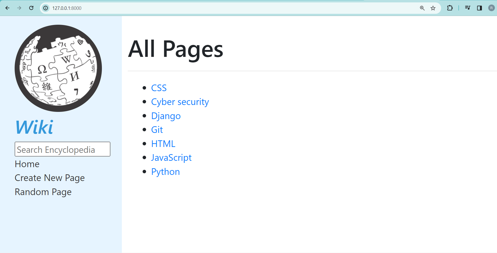
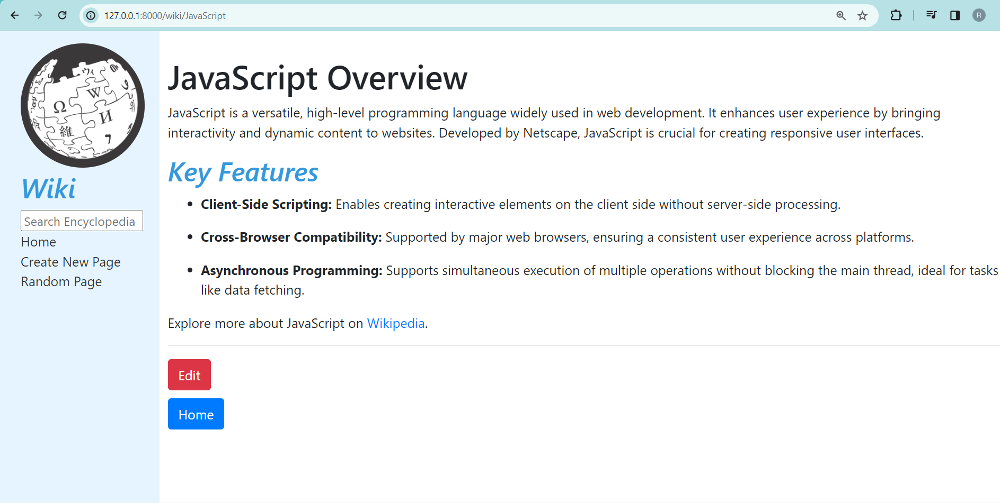
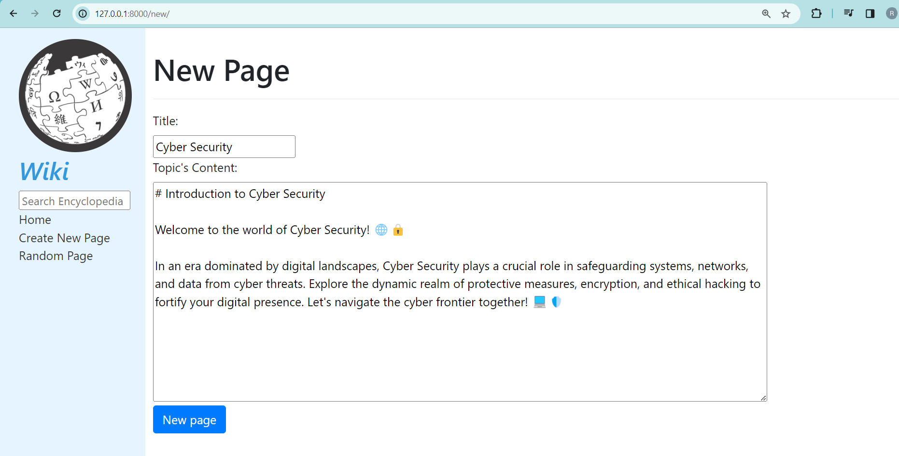

# 🚀 Wiki_wikipedia 🌐
 
Thrilled to unveil my latest solo project – the CS50 Wiki! 🌐✨  
Dive into the world of knowledge with this Django-powered endeavor that captures the charm of Wikipedia, all wrapped in a sleek and user-friendly design. 🚀📚

## Overview

📚 Explore a dynamic Django-powered Wiki platform that stores diverse pages and blogs using markdown files, akin to Wikipedia. Contribute your own content, seamlessly search for existing information, and experience collaborative knowledge-sharing with ease. 💻🌐

## YouTube Tutorial

Watch the YouTube tutorial to learn how to set up and use this project. The tutorial provides a step-by-step guide on running the application and managing the Wiki.

## Screenshots

### Home Page

### Blog Page Example

### New Blog Creation

## How to Use

1. Clone this repository to your local machine.
2. Install the necessary dependencies by running `npm install`.
3. Run the application locally using `npm start`. The app will open in your web browser at [http://localhost:3000](http://localhost:3000).
4. Contribute and explore the Wiki_wikipedia project by following the on-screen instructions.

## Project Structure

This project is structured as follows:

- `src/` contains the React application code.
- `server/` contains the Django server code for managing the Wiki database.

## Additional Information

For more details, you can refer to the [Create React App documentation](https://facebook.github.io/create-react-app/docs/getting-started) and [Django documentation](https://docs.djangoproject.com/).

## Deployment

To deploy this application for production, you can use the `npm run build` command, which will generate a production-ready build in the `build` folder.

## Troubleshooting

If you encounter any issues, please check the troubleshooting guide provided in the Create React App documentation.

